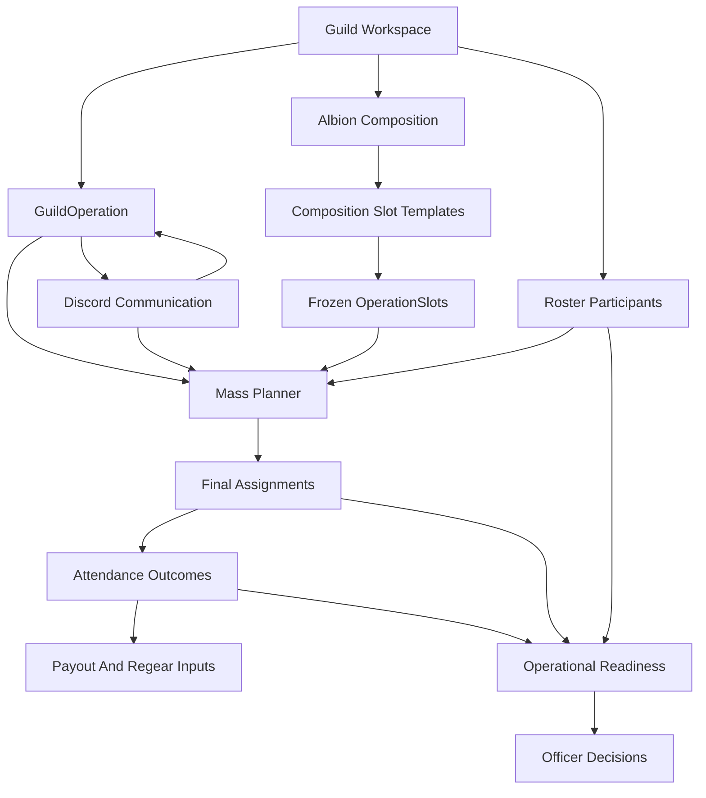
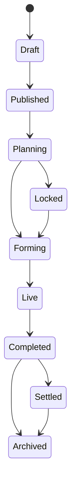
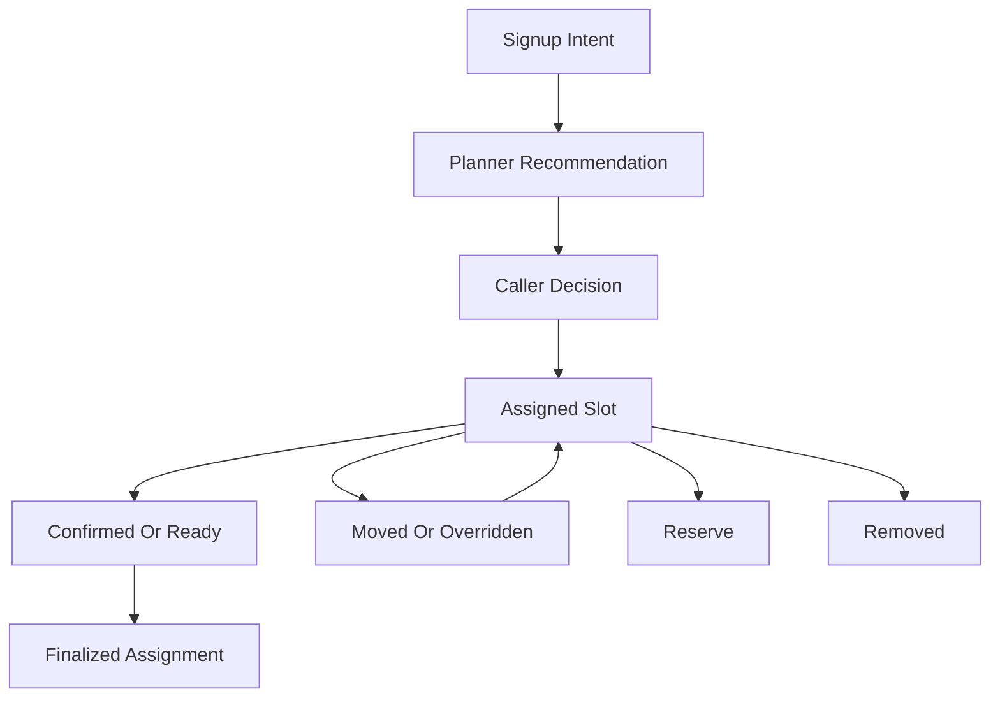
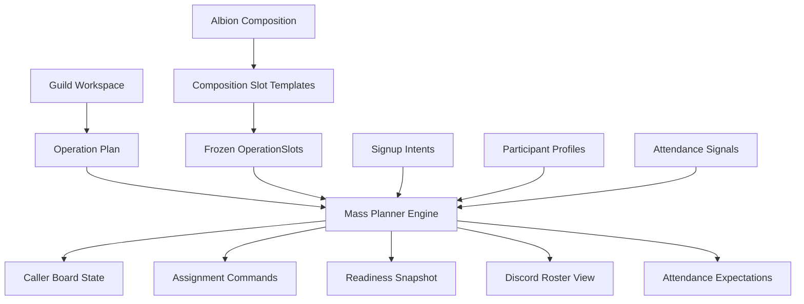
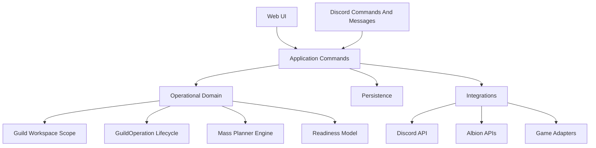

# IronkeepV2 Architecture And Domain Design

## Design Position
IronkeepV2 should be a new product architecture, not a cleaned-up copy of current Ironkeep.

Current Ironkeep is useful as an operational reference for edge cases such as `post_flow` CTAs, P1/P2/P3 signups, fill roles, party assignments, attendance, scout check-ins, payout/regear behavior, and Discord notification patterns. It should not dictate module structure, persistence boundaries, or service design.

IronkeepV2 should be Albion-first: rich Albion builds, parties, roles, compositions, readiness checks, and operational state are the default. Future games are supported through adapters around clearly identified integration points, not by making Albion UX generic.

# IronkeepV2 Scope Rule
IronkeepV2 must first prove:

- operational planning
- assignment flow
- readiness flow

before adding:

- Discord
- payouts
- analytics UI
- advanced permissions
- multi-game systems

This does not mean those systems are unimportant. It means the first architecture milestone must prove the operational core before communication surfaces, economy workflows, dashboards, permission matrices, or adapter-driven game expansion are layered on top.

## 1. Domain Mapping
Primary domains:

- **Guild Workspace**: tenant root for all operational data. Every operational entity is scoped to a guild workspace. Future Discord guild linking belongs here.
- **Guild Operations**: CTAs as structured PvP operations with lifecycle, planning state, readiness state, assignments, and after-action state.
- **Mass Planner**: the operational heart; owns operation slots, comp needs, signup interpretation, assignment state, gaps, and readiness output.
- **Compositions**: Albion builds, roles, party templates, role targets, weapon priorities, and required coverage.
- **Roster / Participants**: players, characters, Discord identity, Albion verification, preferred builds, reliability history.
- **Assignments**: final party/slot/build placement; operational truth for who is expected to show up as what.
- **Attendance**: present, late, absent, no-show, scout/support check-in, voice/check-in evidence, and final attendance outcome.
- **Readiness**: live operational condition of an upcoming CTA: comp coverage, role gaps, missing players, unverified players, late risk, scout status, Discord notification state.
- **Communications**: Discord posts, DMs, reminders, and command interactions as communication surfaces only, never source of truth.
- **Economy Adjacent**: payout and regear consume attendance/assignment outcomes; they should not own operational truth.
- **Officer Decision Signals**: readiness and risk indicators embedded in operational workflows, not vanity dashboards.

Domain relationship:

## 2. Core Operational Entities
Core entities should be modeled around operations, not pages.

- **GuildWorkspace**: the tenant root. Has name, slug, primary game, and future Discord guild link references. All operational commands and queries must be scoped by `guild_workspace_id`.
- **GuildOperation**: a structured CTA inside a GuildWorkspace. Has title, start time, staging context, status, operation type, visibility, future Discord announcement links, and lifecycle state.
- **OperationPlan**: planning configuration for the GuildOperation. References composition, party count, role/slot needs, signup rules, deadline, capacity rules, and readiness thresholds.
- **AlbionComposition**: Albion-specific reusable planning material containing parties, slots, roles, builds, priorities, and optional variants.
- **CompositionSlotTemplate**: reusable slot definition inside an AlbionComposition. It is source material for operation planning, not live operational truth.
- **Build**: Albion build with rich item slots, weapon identity, role fit, priority, requirements, and optional cost/readiness metadata.
- **Participant**: a player in the operation context. Links app user, Discord user, Albion character, guild membership, preferences, reliability summary.
- **SignupIntent**: player intent before caller decision. Contains priority choices, fill willingness, availability, note if retained, source surface (web/Discord), and timestamp.
- **OperationSlot**: frozen operational snapshot generated from CompositionSlotTemplate for one GuildOperation. Has party, role, preferred build/weapon, priority, and fill rules. Later composition edits must never mutate existing OperationSlots.
- **Assignment**: caller-owned final placement of participant into party/role/build/slot. This is the source of truth for expected participation.
- **AttendanceRecord**: final outcome for a participant in an operation: present, late, absent, no-show, excused, scout-check-in, support-check-in, evidence source.
- **ReadinessSnapshot**: computed state of an operation at a point in time: filled slots, role gaps, missing confirmations, risky assignments, scout coverage, Discord comms status.
- **OperationalEvent**: append-only record of meaningful changes: workspace created, signup created, assignment moved, attendance marked, readiness recalculated, notification sent. It always includes `guild_workspace_id`. `guild_operation_id` is nullable because workspace-level events such as `workspace.created` happen before a GuildOperation exists.

Recommended aggregate boundaries:

- **GuildWorkspace Aggregate**: tenant ownership and future external guild links.
- **GuildOperation Aggregate**: lifecycle and plan state.
- **MassPlanner Aggregate**: signup intents, OperationSlots, assignments, gaps, readiness.
- **Attendance Aggregate**: attendance records, check-ins, evidence.
- **Composition Aggregate**: builds, roles, party templates.
- **Communication Aggregate**: Discord messages, reminders, command interactions.

## 3. CTA Lifecycle
CTA lifecycle should express operational reality, not generic event CRUD.

Recommended lifecycle states:

1. **Draft**: officer configures GuildOperation plan, comp, party count, signup rules, and future Discord behavior.
2. **Published**: operation is visible; Discord may announce; signups open.
3. **Planning**: signups are flowing; mass planner tracks needs, gaps, and readiness.
4. **Locked**: signups may be closed or restricted; callers finalize assignments.
5. **Forming**: operation is near start; attendance/scout check-ins become active; readiness becomes urgent.
6. **Live**: operation is in progress; scout/support attendance, late joins, and live overrides are recorded.
7. **Completed**: final attendance and assignments are sealed enough for payout/regear workflows.
8. **Settled**: payouts/regear/settlement workflows have consumed the operation outcome.
9. **Archived**: read-only historical record.

Lifecycle design:

Important lifecycle rules:

- Discord publish/reminder actions are side effects of GuildOperation state, not state itself.
- Assignment finality increases after **Locked** but officer override must remain possible through **Live** with audit trail.
- Attendance starts becoming meaningful at **Forming** and becomes authoritative after **Completed**.
- Payout/regear cannot consume raw signups; they consume final assignments plus attendance outcomes.
- Every lifecycle command must validate `guild_workspace_id` boundaries before changing state.

## 4. Assignment Lifecycle
Assignment should be explicit and caller-owned.

Assignment states:

- **Unassigned**: signup exists but no caller placement.
- **Suggested**: system recommends OperationSlot/build based on comp and preferences; not operational truth yet.
- **Assigned**: caller placed player into party/role/build.
- **Confirmed**: player acknowledged or readiness criteria pass.
- **Changed**: caller moved player; old state retained in audit.
- **Reserve**: player intentionally not in main party slots but available.
- **Removed**: assignment cleared or player cancelled.
- **Finalized**: assignment is part of final operation record.

Assignment principles:

- Signup intent is input; assignment is operational truth.
- Caller override is a first-class path, not an exception hack.
- Every assignment mutation should record who changed it, when, and why if supplied.
- Mass planner should support both fast assignment and reliable post-operation audit.

Assignment flow:

## 5. Attendance Lifecycle
Attendance should be modeled as operational evidence and final outcome.

Attendance states:

- **Expected**: player has a final assignment or explicit reserve expectation.
- **CheckedIn**: player indicates presence/readiness manually or through allowed signal.
- **ScoutCheckedIn**: scout/support-specific check-in with location/time/context.
- **Present**: officer-confirmed participation.
- **Late**: present but late beyond configured threshold.
- **Absent**: did not participate but not necessarily penalized.
- **NoShow**: expected and absent without acceptable signal.
- **Excused**: absent but officer-approved.
- **VerifiedFinal**: sealed for payout/regear/analytics consumption.

Attendance input sources:

- caller manual mark
- scout/support check-in
- voice attendance if enabled
- operation window check-in
- Discord command signal, if explicitly allowed

Attendance rules:

- Attendance consumes final assignments but can include showed-not-assigned players as exceptions.
- Scout attendance is not a side note; it is a first-class operational attendance type.
- Attendance outcomes feed payout/regear eligibility and reliability signals.
- Analytics read verified attendance, not raw Discord interactions.

## 6. Operational Readiness Model
Readiness should answer: **Can this group form and run the operation successfully right now?**

Readiness categories:

- **Composition Coverage**: required slots filled, critical roles filled, party balance, missing weapons.
- **Assignment Confidence**: assigned vs unassigned, reserve depth, fill availability, mismatched role/build preferences.
- **Player Reliability**: late/no-show tendency, recent attendance, role consistency, officer notes if allowed.
- **Verification Readiness**: linked Albion character, guild membership, character validity, build ownership/proficiency where applicable.
- **Attendance Readiness**: checked-in players, missing expected players, late risk, scout/support check-in status.
- **Communication Readiness**: Discord announcement sent, reminders sent, roster published, command interactions synced.
- **Economy Readiness**: payout/regear dependencies available after completion, not before.

Readiness output should be operational and action-oriented:

- “Missing 2 healers in Party 2”
- “3 assigned players not checked in”
- “Scout group has no check-in in last 10 minutes”
- “One critical role assigned to high no-show risk player”
- “Roster posted but assignments changed since publish”

Readiness should not prioritize vanity metrics such as generic activity scores, leaderboards, or engagement charts unless they directly affect officer decisions.

## 7. Mass Planner Engine Design
Mass planner should be designed as the central engine of IronkeepV2.

Responsibilities:

- Interpret signup intents into usable planner candidates.
- Project Albion compositions into frozen OperationSlots for a specific GuildOperation.
- Track unfilled slots, role gaps, party imbalance, reserves, and fill candidates.
- Support caller assignment, quick assignment, drag/drop, manual override, reserve handling.
- Produce readiness snapshots for officers.
- Emit operational events for attendance, analytics, Discord sync, and audit.
- Provide stable query models for caller board, future Discord roster post, and post-operation review.

Mass planner inputs:

- GuildWorkspace
- GuildOperation
- OperationPlan
- AlbionComposition
- OperationSlot list
- Build catalog
- SignupIntent list
- Participant profiles
- Attendance/check-in state
- Officer overrides

Mass planner outputs:

- PlannerBoardState built from OperationSlots
- Assignment mutations
- ReadinessSnapshot
- Discord roster view model
- Attendance expectation list
- Payout/regear eligibility input after completion

Mass planner design flow:

Engine boundaries:

- The engine should not know about HTTP forms, templates, Discord SDK objects, or database rows directly.
- It should accept domain objects and return domain results/view models.
- Persistence, web rendering, and Discord formatting should sit outside the engine.
- Albion specialization belongs in the composition/build/readiness rules, not in generic UI labels.
- The caller board must read from OperationSlots after they are generated, not from live CompositionSlotTemplate data.
- Composition templates are reusable planning material; OperationSlots are frozen operational truth.

## Architecture Direction For IronkeepV2
Recommended architecture:

- **Domain Layer**: GuildWorkspace scoping, GuildOperation lifecycle, assignment lifecycle, attendance lifecycle, mass planner rules, OperationSlot snapshots, readiness model.
- **Application Layer**: explicit commands/use cases such as create GuildOperation, attach OperationPlan, generate OperationSlots, submit signup, assign player, mark attendance, recalc readiness, and later publish Discord roster.
- **Infrastructure Layer**: database, Discord API, Albion API, scheduler, job queue.
- **Presentation Layer**: web UI, Discord commands, Discord notifications.
- **Adapter Layer**: Albion adapter first; future games only plug into composition/readiness/integration contracts where needed.

Architecture diagram:

## What Not To Carry Over From Current Ironkeep
Do not carry over:

- router-centered business logic
- Discord bot as business logic owner
- giant module architecture
- path-inferred permissions as primary authorization design
- analytics as after-the-fact dashboards
- generic SaaS-first abstractions
- game-neutral build UI that weakens Albion UX
- schema drift patterns as architecture
- live composition data driving already-created operation boards
- command handlers that mutate state without an OperationalEvent in the same transaction

Current Ironkeep should remain the checklist for behavior parity and edge cases, not the blueprint.

## First Design Deliverables Before Coding
Before implementation starts, produce these design artifacts:

1. **GuildOperation lifecycle spec** with allowed transitions and side effects.
2. **Mass planner domain model** with inputs/outputs and invariants.
3. **OperationSlot snapshot spec** defining generation, immutability, and composition-edit isolation.
4. **Assignment rules spec** including override and audit behavior.
5. **Attendance and scout attendance spec** including finalization rules.
6. **Readiness scoring/action model** focused on officer decisions.
7. **Albion composition model** defining parties, slots, builds, priorities, and fill behavior.
8. **Discord communication contract** defining what Discord may do and what it must never own.
9. **Behavior parity checklist** from current Ironkeep workflows.

## Implementation Guardrails
These are hard constraints for early IronkeepV2 implementation:

- Do not build advanced abstractions yet.
- Use boring, explicit services and tables.
- Do not genericize Albion UX.
- Do not add Discord ownership of operational state.
- Every command must emit an OperationalEvent in the same transaction as the state change.
- Every command must validate `guild_workspace_id` boundaries before reading or mutating related data.
- OperationalEvents must always include `guild_workspace_id`.
- Operation-level events must include `guild_operation_id`.
- Workspace-level events may set `guild_operation_id` to null.
- Composition templates are reusable planning material.
- OperationSlots are frozen operational truth.
- Planner board reads from OperationSlot, not live CompositionSlotTemplate data, after slots are generated.
- If a command crosses `guild_workspace_id` boundaries, reject it.

# First Buildable Vertical Slice
The first slice should prove the smallest useful V2 operational loop without recreating old Ironkeep architecture.

## Exact Scope
Build a minimal Albion-first operational planning loop:

- Create a GuildWorkspace.
- Create a GuildOperation.
- Attach an OperationPlan.
- Define a simple AlbionComposition.
- Define CompositionSlotTemplate rows.
- Generate frozen OperationSlot rows for that GuildOperation.
- Accept SignupIntent.
- Assign Participant to an OperationSlot.
- Produce a ReadinessSnapshot.
- Record OperationalEvents for meaningful state changes.

Do not include Discord, payouts, regear, analytics UI, multi-game UI, advanced permissions, drag/drop, waitlists, swap requests, voice attendance, scout attendance, alliance workspaces, item database, market prices, or import/export.

## Final Entities
- **GuildWorkspace**: tenant root. All operational data is scoped here. Future Discord guild linking belongs here.
- **GuildOperation**: structured CTA / operation inside a GuildWorkspace.
- **OperationPlan**: planning configuration for one GuildOperation.
- **AlbionComposition**: reusable Albion comp template.
- **CompositionSlotTemplate**: reusable comp slot definition.
- **OperationSlot**: frozen slot snapshot for one GuildOperation, generated from CompositionSlotTemplate.
- **Participant**: minimal player identity inside one GuildWorkspace.
- **SignupIntent**: participant’s requested participation for one GuildOperation.
- **Assignment**: caller’s final placement of Participant into OperationSlot.
- **ReadinessSnapshot**: computed operation readiness.
- **OperationalEvent**: append-only operational timeline event. Always scoped to GuildWorkspace; optionally scoped to GuildOperation when the event is operation-level.

## Final Tables
Minimum tables:

- `guild_workspaces`
- `guild_operations`
- `operation_plans`
- `albion_compositions`
- `composition_slot_templates`
- `operation_slots`
- `participants`
- `signup_intents`
- `assignments`
- `readiness_snapshots`
- `operational_events`

Every table must include `guild_workspace_id` except global migration metadata. Every command and query must filter by `guild_workspace_id`.

`operational_events` has one correction that is required from day one:

- `guild_workspace_id` is always required.
- `guild_operation_id` is nullable.
- If an event is operation-level, `guild_operation_id` must be set.
- If an event is workspace-level, `guild_operation_id` may be null.

Important constraints:

- `operation_plans.guild_operation_id` is unique for the first slice.
- `composition_slot_templates` is unique by `guild_workspace_id`, `albion_composition_id`, `party_number`, `slot_index`.
- `operation_slots` is unique by `guild_workspace_id`, `guild_operation_id`, `party_number`, `slot_index`.
- `signup_intents` is unique by `guild_workspace_id`, `guild_operation_id`, `participant_id`.
- One active assignment per `operation_slot_id`.
- `operational_events` is append-only.

OperationSlot generation must copy from CompositionSlotTemplate:

- `party_number`
- `slot_index`
- `role`
- `build_name`
- `weapon_name`
- `priority`

The mass planner board must not dynamically join live CompositionSlotTemplate data for generated operation boards.

## Service Modules
Use boring, explicit modules:

- `domain/guild_workspace.py`: workspace creation and lookup.
- `domain/guild_operations.py`: GuildOperation statuses and lifecycle validation.
- `domain/albion_compositions.py`: AlbionComposition and CompositionSlotTemplate validation.
- `domain/operation_plans.py`: attach plans and validate same-workspace composition/operation relationships.
- `domain/mass_planner.py`: generate OperationSlots, assign participants, validate slot invariants, return board state.
- `domain/readiness.py`: calculate ReadinessSnapshot from slots, assignments, and signups.
- `domain/operational_events.py`: event type names and event creation helpers.
- `application/use_cases.py`: first-slice commands that orchestrate transactions.

Avoid CQRS, event sourcing, microservices, plugin systems, generic SaaS frameworks, or complex repository layers in this slice.

## Implementation Order
1. Create schema with `guild_workspace_id` on all operational tables.
2. Implement GuildWorkspace creation.
3. Implement GuildOperation creation and `guild_operation.created` event.
4. Implement AlbionComposition and CompositionSlotTemplate creation.
5. Implement OperationPlan attachment with same-workspace validation.
6. Generate frozen OperationSlots from CompositionSlotTemplate.
7. Submit SignupIntent and create/find Participant.
8. Assign Participant to OperationSlot.
9. Calculate ReadinessSnapshot.
10. Build minimal UI for operations, composition setup, plan attachment, signup, mass planner board, and event timeline.

## Excluded Systems
Excluded from the first slice:

- Discord bot, OAuth, Discord posts, DMs, reminders.
- Payouts, regear, settlements, ledger.
- Analytics UI, benchmarks, leaderboards, advanced reliability scoring.
- Multi-game UI and game selector.
- Advanced permissions, role matrix, guild onboarding.
- Albion item database, item icons, market prices, IP calculator.
- Drag/drop assignment.
- Waitlist, swap requests, signup deadlines.
- Voice attendance and scout attendance.
- Alliance workspace.
- Composition import/export.

## Tests
Required unit tests:

- GuildWorkspace creation works.
- GuildOperation requires `guild_workspace_id`.
- AlbionComposition requires `guild_workspace_id`.
- CompositionSlotTemplate enforces unique party/slot per composition.
- OperationPlan cannot attach a composition from another GuildWorkspace.
- OperationSlot generation copies CompositionSlotTemplate data.
- Later changes to CompositionSlotTemplate do not change existing OperationSlot rows.
- OperationSlot generation is idempotent or clearly rejected if slots already exist.
- SignupIntent is unique per participant per GuildOperation.
- Assignment requires same workspace across GuildOperation, OperationSlot, and Participant.
- Assignment prevents double-assigning one active OperationSlot.
- ReadinessSnapshot calculates total slots, assigned slots, open slots, unassigned signups, and missing roles.
- Each command records an OperationalEvent in the same transaction as the state change.
- Workspace-level events set `guild_workspace_id` and may leave `guild_operation_id` null.
- Operation-level events set both `guild_workspace_id` and `guild_operation_id`.

Required integration tests:

- Full happy path: create workspace, create operation, create composition, attach plan, generate operation slots, submit signup, assign participant, calculate readiness, verify event timeline.
- Frozen slot behavior: generate operation slots, edit composition template, verify operation slots remain unchanged.
- Guild scoping: create two workspaces and verify cross-workspace operation/composition/participant references are rejected.

## Manual Smoke Checklist
1. Create GuildWorkspace: `Orbie`.
2. Create GuildOperation: `Saturday ZvZ`.
3. Create AlbionComposition: `Basic 5-man Party`.
4. Add composition slots:
   - Party 1 Slot 1: Tank / Camlann
   - Party 1 Slot 2: Healer / Hallowfall
   - Party 1 Slot 3: DPS / Permafrost
   - Party 1 Slot 4: Support / Enigmatic
   - Party 1 Slot 5: DPS / Realmbreaker
5. Attach composition to `Saturday ZvZ`.
6. Generate OperationSlot records.
7. Edit the source composition slot from `Hallowfall` to `Great Holy`.
8. Confirm the already-created OperationSlot still says `Hallowfall`.
9. Submit SignupIntent:
   - Participant: `PlayerOne`
   - Preferred role: `Healer`
   - Preferred build: `Hallowfall`
   - Availability: `confirmed`
10. Open mass planner board.
11. Assign `PlayerOne` to Party 1 Slot 2.
12. Confirm readiness:
   - total slots: `5`
   - assigned slots: `1`
   - open slots: `4`
   - unassigned signups: `0`
   - missing roles include remaining open roles
13. Confirm event timeline contains workspace created, guild operation created, composition created, operation plan attached, operation slots generated, signup intent submitted, assignment created, and readiness snapshot created.

## Acceptance Criteria
The first slice is complete when:

- All operational data is scoped to GuildWorkspace.
- GuildOperation replaces generic Operation in implementation-facing language.
- OperationSlot replaces PlannerSlot.
- OperationSlot is a frozen snapshot of the composition at generation time.
- Composition edits do not silently affect existing operation slots.
- A user can complete the full flow from workspace to operation readiness.
- OperationalEvents are recorded in the same transaction for every meaningful command.
- No Discord, payouts, regear, analytics UI, multi-game UI, or advanced permissions are included.
- The implementation remains small enough for 1-2 weeks.

# Recommended Initial Implementation Order
Use this order for the first build:

1. **Schema and guild scoping**: create first-slice tables, constraints, indexes, and `guild_workspace_id` checks.
2. **GuildWorkspace**: create and load the tenant root.
3. **GuildOperation**: create the structured CTA and write its OperationalEvent.
4. **AlbionComposition**: create a simple composition and slot templates.
5. **OperationPlan**: attach composition to GuildOperation with same-workspace validation.
6. **OperationSlot generation**: freeze composition slots into operation slots.
7. **SignupIntent**: accept participant intent for the GuildOperation.
8. **Assignment**: assign participant to an OperationSlot.
9. **ReadinessSnapshot**: compute readiness from OperationSlots, assignments, and SignupIntents.
10. **Minimal UI**: operations list, create operation, composition builder, plan attach/generate slots, signup, mass planner board, event timeline.

# Pre-Implementation Build Plan
Before writing implementation code for the first slice, confirm this concrete file, schema, service, and command plan.

## Exact Files To Create Or Modify
Modify:

- `docs/ironkeepv2_domain_architecture_2efac00f.plan.md`
  - Keep the architecture plan current with the approved OperationalEvent correction and first-slice implementation plan.

Create:

- `requirements.txt`
  - Minimal Python dependencies: `fastapi`, `uvicorn`, `jinja2`, `python-multipart`, `pytest`, `httpx`.
- `app/__init__.py`
- `app/main.py`
  - FastAPI app, route registration, startup database initialization.
- `app/database.py`
  - SQLite connection helper, transaction helper, schema initialization.
- `app/schema.sql`
  - First-slice schema.
- `app/domain/__init__.py`
- `app/domain/guild_workspace.py`
  - Workspace validation helpers.
- `app/domain/guild_operations.py`
  - GuildOperation statuses and validation.
- `app/domain/albion_compositions.py`
  - Composition and slot-template validation.
- `app/domain/operation_plans.py`
  - Same-workspace validation for operation-plan attachment.
- `app/domain/mass_planner.py`
  - OperationSlot generation rules and assignment invariants.
- `app/domain/readiness.py`
  - ReadinessSnapshot calculation.
- `app/domain/operational_events.py`
  - Event type constants and event payload helpers.
- `app/application/__init__.py`
- `app/application/use_cases.py`
  - Transactional command functions for the first slice.
- `app/repositories.py`
  - Explicit raw-SQL reads and writes. No ORM, no repository framework.
- `app/routes.py`
  - Minimal HTML routes and forms for the vertical slice.
- `app/templates/base.html`
- `app/templates/workspaces.html`
- `app/templates/operations.html`
- `app/templates/create_operation.html`
- `app/templates/compositions.html`
- `app/templates/create_composition.html`
- `app/templates/operation_plan.html`
- `app/templates/signup.html`
- `app/templates/planner_board.html`
- `tests/conftest.py`
- `tests/test_vertical_slice.py`
- `tests/test_guild_scoping.py`
- `tests/test_frozen_operation_slots.py`
- `tests/test_operational_events.py`

## Schema And Migration Design
Use one boring initial SQLite schema in `app/schema.sql`. Do not add Alembic yet.

Tables:

- `guild_workspaces`
  - `id TEXT PRIMARY KEY`
  - `name TEXT NOT NULL`
  - `slug TEXT NOT NULL UNIQUE`
  - `primary_game TEXT NOT NULL DEFAULT 'albion'`
  - `created_at TEXT NOT NULL`
  - `updated_at TEXT NOT NULL`
- `guild_operations`
  - `id TEXT PRIMARY KEY`
  - `guild_workspace_id TEXT NOT NULL`
  - `title TEXT NOT NULL`
  - `operation_type TEXT NOT NULL DEFAULT 'zvz'`
  - `scheduled_start_at TEXT NOT NULL`
  - `status TEXT NOT NULL DEFAULT 'draft'`
  - timestamps
- `albion_compositions`
  - `id TEXT PRIMARY KEY`
  - `guild_workspace_id TEXT NOT NULL`
  - `name TEXT NOT NULL`
  - `description TEXT`
  - timestamps
- `composition_slot_templates`
  - `id TEXT PRIMARY KEY`
  - `guild_workspace_id TEXT NOT NULL`
  - `albion_composition_id TEXT NOT NULL`
  - `party_number INTEGER NOT NULL`
  - `slot_index INTEGER NOT NULL`
  - `role TEXT NOT NULL`
  - `build_name TEXT NOT NULL`
  - `weapon_name TEXT`
  - `priority TEXT NOT NULL DEFAULT 'normal'`
  - timestamps
  - unique: `(guild_workspace_id, albion_composition_id, party_number, slot_index)`
- `operation_plans`
  - `id TEXT PRIMARY KEY`
  - `guild_workspace_id TEXT NOT NULL`
  - `guild_operation_id TEXT NOT NULL UNIQUE`
  - `albion_composition_id TEXT NOT NULL`
  - `signup_status TEXT NOT NULL DEFAULT 'open'`
  - `max_participants INTEGER`
  - `notes TEXT`
  - timestamps
- `operation_slots`
  - `id TEXT PRIMARY KEY`
  - `guild_workspace_id TEXT NOT NULL`
  - `guild_operation_id TEXT NOT NULL`
  - `source_composition_slot_template_id TEXT`
  - copied snapshot fields: `party_number`, `slot_index`, `role`, `build_name`, `weapon_name`, `priority`
  - `status TEXT NOT NULL DEFAULT 'open'`
  - `created_at TEXT NOT NULL`
  - unique: `(guild_workspace_id, guild_operation_id, party_number, slot_index)`
- `participants`
  - `id TEXT PRIMARY KEY`
  - `guild_workspace_id TEXT NOT NULL`
  - `display_name TEXT NOT NULL`
  - `albion_character_name TEXT`
  - timestamps
  - unique: `(guild_workspace_id, display_name)`
- `signup_intents`
  - `id TEXT PRIMARY KEY`
  - `guild_workspace_id TEXT NOT NULL`
  - `guild_operation_id TEXT NOT NULL`
  - `participant_id TEXT NOT NULL`
  - `preferred_role TEXT NOT NULL`
  - `preferred_build_name TEXT`
  - `willingness TEXT NOT NULL DEFAULT 'specific'`
  - `availability TEXT NOT NULL DEFAULT 'confirmed'`
  - `created_at TEXT NOT NULL`
  - unique: `(guild_workspace_id, guild_operation_id, participant_id)`
- `assignments`
  - `id TEXT PRIMARY KEY`
  - `guild_workspace_id TEXT NOT NULL`
  - `guild_operation_id TEXT NOT NULL`
  - `operation_slot_id TEXT NOT NULL`
  - `participant_id TEXT NOT NULL`
  - `assigned_role TEXT NOT NULL`
  - `assigned_build_name TEXT NOT NULL`
  - `status TEXT NOT NULL DEFAULT 'assigned'`
  - `assigned_at TEXT NOT NULL`
  - first-slice rule: one assignment row per `operation_slot_id`
- `readiness_snapshots`
  - `id TEXT PRIMARY KEY`
  - `guild_workspace_id TEXT NOT NULL`
  - `guild_operation_id TEXT NOT NULL`
  - `total_slots INTEGER NOT NULL`
  - `assigned_slots INTEGER NOT NULL`
  - `open_slots INTEGER NOT NULL`
  - `unassigned_signup_count INTEGER NOT NULL`
  - `missing_roles_json TEXT NOT NULL`
  - `readiness_state TEXT NOT NULL`
  - `created_at TEXT NOT NULL`
- `operational_events`
  - `id TEXT PRIMARY KEY`
  - `guild_workspace_id TEXT NOT NULL`
  - `guild_operation_id TEXT NULL`
  - `event_type TEXT NOT NULL`
  - `actor_type TEXT NOT NULL`
  - `actor_id TEXT`
  - `entity_type TEXT NOT NULL`
  - `entity_id TEXT NOT NULL`
  - `payload_json TEXT NOT NULL`
  - `occurred_at TEXT NOT NULL`

OperationalEvent rule:

- Workspace-level event example: `workspace.created` sets `guild_workspace_id` and leaves `guild_operation_id` null.
- Operation-level event example: `guild_operation.created` sets both `guild_workspace_id` and `guild_operation_id`.
- The use-case layer enforces that operation-level events require `guild_operation_id`.

## Service And Module Structure
Keep implementation explicit:

- `app/domain/*`
  - Small validation and calculation helpers.
  - No database access.
- `app/application/use_cases.py`
  - Owns transactions.
  - Calls repository functions.
  - Calls domain validators and calculators.
  - Writes OperationalEvent in the same transaction as every state change.
- `app/repositories.py`
  - Raw SQL only.
  - Every read/write takes `guild_workspace_id`.
  - Cross-workspace validation helpers live here or are called from use cases.
- `app/routes.py`
  - Thin FastAPI HTML routes.
  - No business rules beyond form parsing and redirecting.

## Command Flow
1. `CreateGuildWorkspace`
   - Insert workspace.
   - Insert `workspace.created` with `guild_operation_id = NULL`.
   - Commit transaction.
2. `CreateGuildOperation`
   - Validate workspace exists.
   - Insert operation.
   - Insert `guild_operation.created` with operation id.
   - Commit.
3. `CreateAlbionComposition`
   - Validate workspace.
   - Insert composition.
   - Insert slot templates.
   - Insert `albion_composition.created`.
   - Commit.
4. `AttachOperationPlan`
   - Validate operation and composition both belong to same workspace.
   - Insert one plan.
   - Insert `operation_plan.attached`.
   - Commit.
5. `GenerateOperationSlots`
   - Validate operation plan belongs to workspace.
   - Read composition slot templates.
   - Copy template fields into `operation_slots`.
   - Do not use live templates after this for board display.
   - Insert `operation_slots.generated`.
   - Commit.
6. `SubmitSignupIntent`
   - Validate operation belongs to workspace.
   - Create/find participant scoped to workspace.
   - Insert signup intent.
   - Insert `signup_intent.submitted`.
   - Commit.
7. `AssignParticipantToOperationSlot`
   - Validate operation, slot, participant, and signup all belong to workspace.
   - Reject if slot already assigned.
   - Copy assigned role/build from `operation_slots`.
   - Insert assignment.
   - Update operation slot status to `assigned`.
   - Insert `assignment.created`.
   - Calculate readiness snapshot.
   - Insert `readiness_snapshot.created`.
   - Commit all together.
8. `CalculateReadinessSnapshot`
   - Validate operation belongs to workspace.
   - Count slots, assignments, and unassigned signups.
   - Compute missing roles from open operation slots.
   - Insert snapshot.
   - Insert `readiness_snapshot.created`.
   - Commit.

## Confirmed Excluded Systems
Still excluded from this slice:

- Discord
- payouts
- regear
- analytics UI
- advanced permissions
- multi-game UI/support
- Discord OAuth
- role matrix
- guild onboarding
- Albion item database/icons/prices
- drag/drop assignment
- waitlists
- swap requests
- scout attendance
- voice attendance
- alliance workspaces
- comp import/export
- CQRS/event sourcing/microservices/plugin systems

The only future-facing field included now is `guild_workspaces.primary_game = 'albion'`, but no multi-game UI or adapter logic is implemented in this slice.

## Approval Gate
Implementation should not start until the file list, schema design, service/module structure, command flow, and exclusions above are explicitly approved.

## Core Acceptance Criteria For Architecture
IronkeepV2 architecture is acceptable when:

- CTAs are modeled as structured operations, not generic events.
- GuildWorkspace is the tenant root and all operational entities are guild-scoped.
- Mass planner owns operational state and caller decisions.
- OperationSlots are frozen operational truth generated from CompositionSlotTemplates.
- Discord is clearly a communication layer only.
- Attendance, assignments, and readiness are first-class domain systems.
- Payout/regear consume finalized operation outcomes instead of raw signup data.
- Albion UX remains specialized and rich.
- Future game support is adapter-based without forcing generic Albion UI.
- Current Ironkeep behavior can be referenced and migrated without inheriting its architecture.